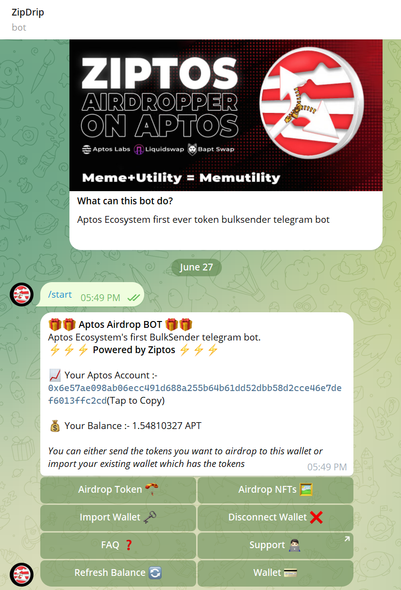
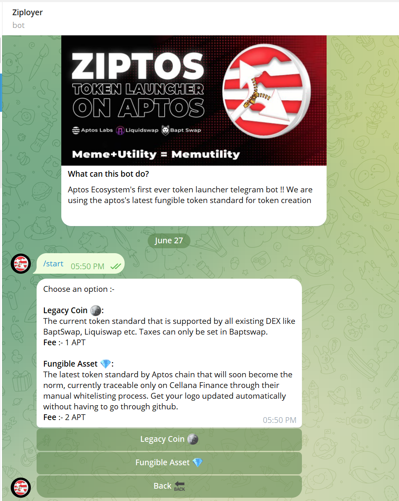

<p align="center">

</p>


## About Us

**Ziptos** is an innovative suite of tools and solutions built on the Aptos blockchain and the most usable, accessible blockchain app called Telegram

Ziptos has two tools which are live. They can be accessed using these links [Ziployer](https://t.me/ZiptosBot) & [Zipdrip](https://t.me/ZiptosAirdropBot). Currently our tools are compatible with [Aptos](https://aptoslabs.com/) blockchain.


## Background

The Ziptos ecosystem not only simplifies blockchain interactions but also drives adoption and innovation. By providing tools and features that lower the barrier to entry, it empowers more people to participate in the blockchain revolution and join the next potential boom chain [Aptos](https://aptoslabs.com/). 

## Set up - cli:
The move contracts in ziptos need aptos CLI to compile. Assuming the aptos cli is not configured, and install the aptos cli from [here](https://aptos.dev/tools/aptos-cli/install-cli/)

- setting up aptos cli: 
    - `aptos init`
        ```console
        ➜  contract aptos init                                                                   
        Configuring for profile default
        Choose network from [devnet, testnet, mainnet, local, custom | defaults to devnet]

        No network given, using devnet...
        Enter your private key as a hex literal (0x...) [Current: None | No input: Generate new key (or keep one if present)]

        No key given, generating key...
        Account 6e883ebdb5d98037043e6133620889b36aefd225ca8639fb19bac0f7d8d71f7b doesn't exist, creating it and funding it with 100000000 Octas
        Account 6e883ebdb5d98037043e6133620889b36aefd225ca8639fb19bac0f7d8d71f7b funded successfully

        ---
        Aptos CLI is now set up for account 6e883ebdb5d98037043e6133620889b36aefd225ca8639fb19bac0f7d8d71f7b as profile default!  Run `aptos --help` for more information about commands
        {
        "Result": "Success"
        }
        ```
    - fund the default account: `aptos account fund-with-faucet --account default`
        ```console
        ➜  contract aptos account fund-with-faucet --account default                             
            {
            "Result": "Added 100000000 Octas to account 6e883ebdb5d98037043e6133620889b36aefd225ca8639fb19bac0f7d8d71f7b"
            }
        ```

## Compile
- To compile Fungible Asset creation Contract `aptos move compile --package-dir facoin`
- To compile Zipdrip Framework move Contract `aptos move compile --package-dir zipdrip_framework`
- To compile Ziployer Framework move Contract `aptos move compile --package-dir ziployer_framework`


        ```console
        ➜  aptos move compile --package-dir facoin    
            UPDATING GIT DEPENDENCY https://github.com/aptos-labs/aptos-core.git
            INCLUDING DEPENDENCY AptosFramework
            INCLUDING DEPENDENCY AptosStdlib
            INCLUDING DEPENDENCY MoveStdlib
            BUILDING ZIPTOS334                    
            {
                "Result": [
                    "6e57ae098ab06ecc491d688a255b64b61dd52dbb58d2cce46e7def6013ffc2cd::fa_coin"
                        ]
            }

        ```

## Publish

- To publish Fungible Asset Contract `aptos move compile --package-dir facoin`
- To publish Zipdrip Framework Contract `aptos move compile --package-dir zipdrip_framework`
- To publish Ziployer Framework Contract `aptos move compile --package-dir ziployer_framework`

        ```console
        ➜  aptos move publish --package-dir zipdrip_framework
            UPDATING GIT DEPENDENCY https://github.com/aptos-labs/aptos-core.git
            UPDATING GIT DEPENDENCY https://github.com/aptos-labs/aptos-core.git
            UPDATING GIT DEPENDENCY https://github.com/aptos-labs/aptos-core.git
            INCLUDING DEPENDENCY AptosFramework
            INCLUDING DEPENDENCY AptosStdlib
            INCLUDING DEPENDENCY AptosToken
            INCLUDING DEPENDENCY AptosTokenObjects
            INCLUDING DEPENDENCY MoveStdlib
            BUILDING zipdrip_framework                   
            package size 3829 bytes
            Do you want to submit a transaction for a range of [8200 - 12300] Octas at a gas unit price of 100 Octas? [yes/no]
            {
                "Result": {
                    "transaction_hash": "0x94ad3504fb1948943b48c1170e5ad529f3009a9e0bb7bb60e2c574aa4ae81a71",
                    "gas_used": 82,
                    "gas_unit_price": 100,
                    "sender": "6e57ae098ab06ecc491d688a255b64b61dd52dbb58d2cce46e7def6013ffc2cd",
                    "sequence_number": 66,
                    "success": true,
                    "timestamp_us": 1719489652832123,
                    "version": 1002321961,
                    "vm_status": "Executed successfully"
                            }
            }

        ```

## Usage
- To bulksend NFT V2

  ```
      entry fun bulkSendNftV2<Token : key>(deployer: &signer, nftAddresses: vector<Object<Token>>,to: vector<address>) acquires Config {

      let length_Nft: u64 = vector::length<Object<Token>>(&nftAddresses);

      let length_to: u64 = vector::length<address>(&to);

        assert!(
            length_Nft == length_to, 
            ERROR_LENGTH_NOT_SAME
        );

        for (i in 0..length_Nft) {
           object::transfer( deployer, *vector::borrow(&nftAddresses, i), *vector::borrow(&to, i));
        };

        collect_nftFee(deployer,length_Nft);
        }
  ```

- To bulksend NFT V1
  
  ```
        entry fun bulkSendNftV1(deployer: &signer,
      receiver: vector<address>,
      creator: address,
      collection: String,
      name: vector<String>,
      property_version: vector<u64>,
      amount: u64,) acquires Config  {
        
        let length_Name: u64 = vector::length<String>(&name);
        let length_To: u64 = vector::length<address>(&receiver);
        let length_property: u64 = vector::length<u64>(&property_version);

          assert!(
            length_Name == length_To, 
            ERROR_LENGTH_NOT_SAME
        );

        assert!(
            length_Name == length_property, 
            ERROR_LENGTH_NOT_SAME
        );

           for (i in 0..length_Name) {
            let token_id = token::create_token_id_raw(creator, collection, *vector::borrow(&name, i), *vector::borrow(&property_version, i));
            token_transfers::offer(deployer,*vector::borrow(&receiver, i),token_id,amount);
        };

        collect_nftFee(deployer,length_To);
        }
  ```

- To bulksend Legacy Coin

    ```
    public entry fun bulkSendLegacyCoin<CoinType>(deployer: &signer, to:  vector<address>, amount: vector<u64>) acquires Config  {
        batch_transfer_coins<CoinType>(deployer,to,amount);
        let length_to: u64 = vector::length<address>(&to);
        collect_legacyCoinFee(deployer,length_to)
    }
    ```

- To bulksend Fungible Asset

  ```
      entry fun bulkSendFungibleAsset<Metadata : key>(sender: &signer, metadata: object::Object<Metadata>, recipient: vector<address>, amount: vector<u64>) acquires Config {

        let length_Amount: u64 = vector::length<u64>(&amount);
        let length_Recipient: u64 = vector::length<address>(&recipient);

        assert!(
            length_Amount == length_Recipient, 
            ERROR_LENGTH_NOT_SAME
        );

        for (i in 0..length_Amount) {
             transfer(sender, metadata, *vector::borrow(&recipient, i), *vector::borrow(&amount, i));
        };

        collect_fungibleAssetFee(sender,length_Amount);
        }
  ```
    
  
<p align="center">


</p>


## License

Ziptos is released under the open source [Apache License](LICENSE). If you utilize Ziptos, kindly acknowledge it within your product and provide a link to [Ziptos On Aptos](https://t.me/ZiptosOnAptos).
